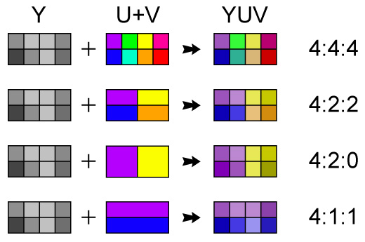

# 1 - Considere as normas de compressão de vídeo.

a) (1,5 val) Admita que pretende transmitir um vídeo num canal de com 6Mbit/s. A resolução para a componente luminância (8 bit por amostra) é de 1920x1080 pixeis e é usado subsampling de cor 4:1:1. Considerando que o factor de compressão é de 40 e 20 para a luminância e crominância respectivamente, calcule o frame rate máximo que consegue transmitir.




* `1920 x 1080 x 8 / 4 / 20 = 207360 ~= 0,2 Mb`

* `frame rate = 6 Mb / 0,2 Mb = 30 frames/s`

b) (1,0 val) Se quiser aumentar o frame rate da alínea anterior, mantendo o mesmo canal, quais os processos que mudaria?

* `converter as imagens para jpeg para ficarem menos pesadas (?)`
* `utilizar sequências de frames utilizando I-frames e P-frames para reduzir o bit rate (?)`

c) (1,5 val) Qual o mecanismo usado nos codificadores de vídeo para estes gerarem um débito binário aproximadamente constante.

`aaa`


# 2. Considere mensagem com 4 símbolos (A; B; F; N): “BANANABANABANAFA”

a) Pretende-se codificar esta mensagem usando um código de Huffman.
* i. (2,0 val) Estime as probabilidades dos símbolos baseado no número de
ocorrências na mensagem, e crie o código de Huffman para estes
símbolos. Codifique a mensagem.

    ```
    A - 8
    N - 4
    B - 3
    F - 1
    ```

    ```
    A   (0)       A   (0)       A   (0)
    N   (00)      N   (00)      NBF (1)
    B   (0010)    BF  (01)
    F   (0011)
    ```

    ```
    0010 0 00 0 00 0 0010 0 00 0 0010 0 00 0 0011 0
    ```

* ii. (1,5 val) Calcule a eficiência do código e a taxa de compressão. Explicite
todos os pressupostos assumidos.

    ```python
    Tc = Do / Dc

    Do = 12 * 8 = 96 bits
    Dc = 32 bits
    Tc = 96 / 32 = 3 
                 ~> 66,6 %
    ```

    ```python
    H(S) = Do / Dc
    ```

b) (2,5 val) Codifique esta mensagem usando o código LZW. Assuma que o dicionário inicial é: [1-A; 2-B; 3-F; 4-N].

**BANANABANABANAFA**

|string w|symbol s|  output|  string|    code|
|:------:|:------:|:------:|:------:|:------:|
|        |        |        |       A|       1|
|        |        |        |       B|       2|
|        |        |        |       F|       3|
|        |        |        |       N|       4|
|       B|       A|       2|      BA|       5|
|       A|       N|       1|      AN|       6|
|       N|       A|       4|      NA|       7|
|       A|       N|        |        |        |
|      AN|       A|       6|     ANA|       8|
|       A|       B|       1|      AB|       9|
|       B|       A|        |        |        |
|      BA|       N|       5|     BAN|      10|
|       N|       A|        |        |        |
|      NA|       B|       7|     NAB|      11|
|       B|       A|        |        |        |
|      BA|       N|        |        |        |
|     BAN|       A|      10|    BANA|      12|
|       A|       F|       1|      AF|      13|
|       F|       A|       3|      FA|      14|
|       A|        |       1|        |        |
<br>

* **Código enviado:** 2 1 4 6 1 5 7 10 1 3 1


c) (1,0 val) Calcule a eficiência do código LZW e a taxa de compressão.

```python
Tc = Do / Dc

Do = 16 simbolos *  8 = 128 bits
Dc = 11 códigos  * 12 = 122 bits
Tc = 128 / 122 = 1.05 
               ~> 4,69 %
```

```python
H(S) = Do / Dc
```

d) (1,0 val) Calcule o número médio de bits por símbolo para os dois códigos (Huffman e LZW), compare e comente os resultados. Proponha um método de codificação alternativo.

```python
Huffman: (1 + 2 + 4 + 4) / 4 = 3
LZW:
```

```
Algorítmo Shannon-Fano

1 – ordenar os símbolos por ordem decrescente de probabilidade (contabilizando o número de ocorrências de cada símbolo na mensagem)
2 – Separar em dois grupos os símbolos com aproximadamente o mesmo número de occorrências
3 – Atribuir a cada grupo o bit 0 e 1
4 – voltar ao ponto dois até que cada grupo tenha apenas um símbolo
```

# 3. Considere a norma de compressão JPEG de uma imagem a cores com resolução de 1280x720 na luminância, subsampling de cor, 4:2:2 e 8 bits por amostra.

a) (1,5 val) Quantos blocos de luminância e de crominância existem na imagem? Qual o
tamanho em bits da imagem, sabendo que o factor de compressão para a luminância é de 30 e da crominância de 40.

* `lum = 1280 x 720 / (8 x 8) = 14,400 blocos`
* `crom = 1280 x 720 / 2 / (8 x 8) = 7,200 blocos`

b) (3,0 val) Admita que a figura representa a DCT do primeiro bloco de luminância. Codifique este bloco. (Use para o efeito a as matrizes e tabelas da norma)

|   |   |   |   |   |   |   |   |
|:-:|:-:|:-:|:-:|:-:|:-:|:-:|:-:|
| 64|  4|  3| -1|  2|  5| -4|  5|
|  1|  2| -1|  2| -2|  3| -1|  2|
|  3|  4| -3|  5|  6|  3|  2|  2|
| -1| -1|  2|-30|  4|  5|  4|  2|
|  1| 25|  3|  4| -1|  2|  2|  1|
|  3|  2| -5|  4| -3|  2|  1|  1|
|  2| -1|  3|  2|  2| -1|  2|  1|
|  1| -1|  1|  2| -3|  4|  1| -1|
<br>

|   |   |   |   |   |   |   |   |
|:-:|:-:|:-:|:-:|:-:|:-:|:-:|:-:|
|  4|  0|  0|  0|  0|  0|  0|  0|
|  0|  0|  0|  0|  0|  0|  0|  0|
|  0|  0|  0|  0|  0|  0|  0|  0|
|  0|  0|  0| -1|  0|  0|  0|  0|
|  0|  1|  0|  0|  0|  0|  0|  0|
|  0|  0|  0|  0|  0|  0|  0|  0|
|  0|  0|  0|  0|  0|  0|  0|  0|
|  0|  0|  0|  0|  0|  0|  0|  0|
<br>

# 4. Considere a transformada DCT 2D na codificação de imagens.
a) (1,5 val) Calcule a DCT de um bloco de 8x8 com valores constantes para todos os pixeis. Assuma que o valor de todos os pixeis é igual a μ e expresse o resultado em termos desta constante.

```
y(0,0) = 2/8 * sqrt(2)/2 * sqrt(2)/2 * sum sum cos(0) * cos(0) * (μ*64)
y(0,0) = (μ*64) / 8 
```

|   |   |   |   |   |   |   |   |
|:-:|:-:|:-:|:-:|:-:|:-:|:-:|:-:|
|y(0,0)|  0|  0|  0|  0|  0|  0|  0|
|  0|  0|  0|  0|  0|  0|  0|  0|
|  0|  0|  0|  0|  0|  0|  0|  0|
|  0|  0|  0|  0|  0|  0|  0|  0|
|  0|  0|  0|  0|  0|  0|  0|  0|
|  0|  0|  0|  0|  0|  0|  0|  0|
|  0|  0|  0|  0|  0|  0|  0|  0|
|  0|  0|  0|  0|  0|  0|  0|  0|

b) (2,0 val) Calcule a DCT inversa do seguinte bloco de 2x2:

|   |   |
|:-:|:-:|
| -1|  0|
|  0|  3|
<br>